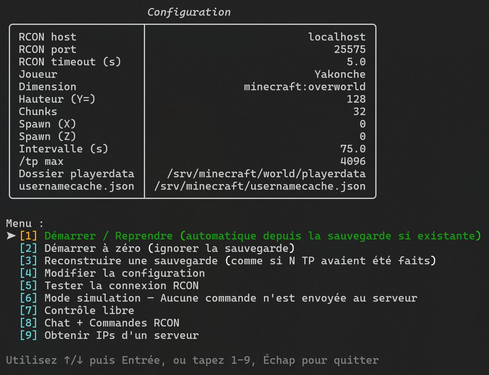
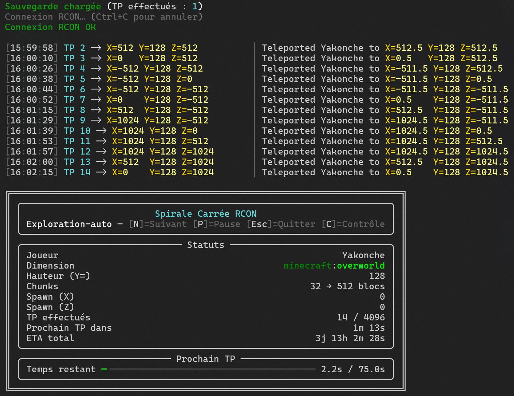
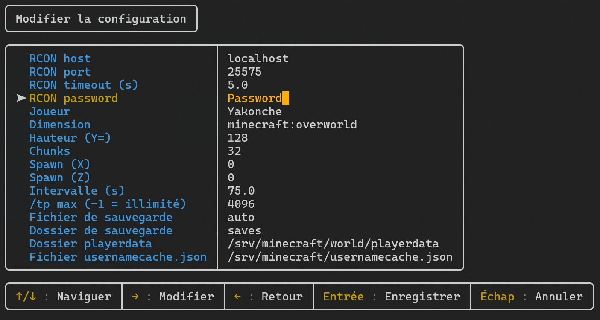
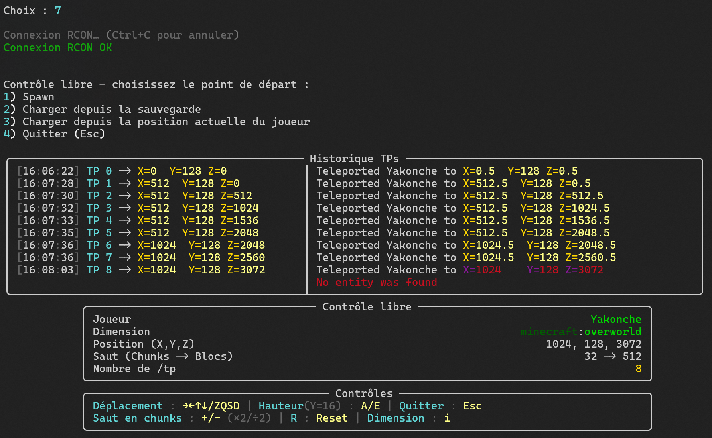
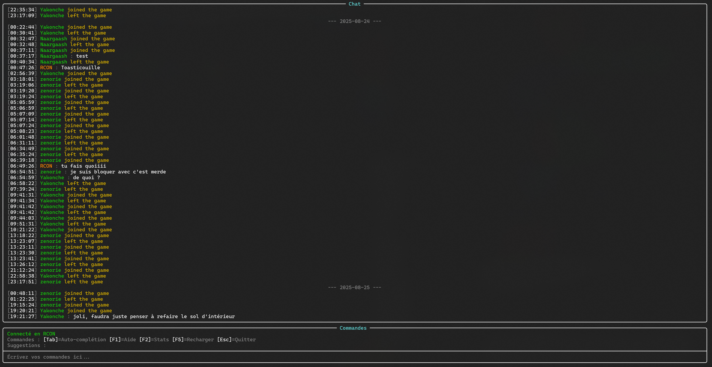
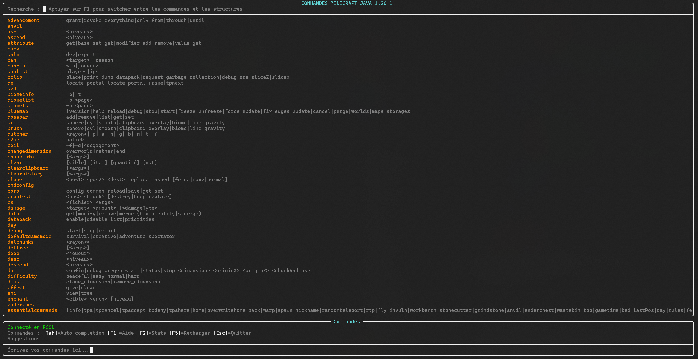
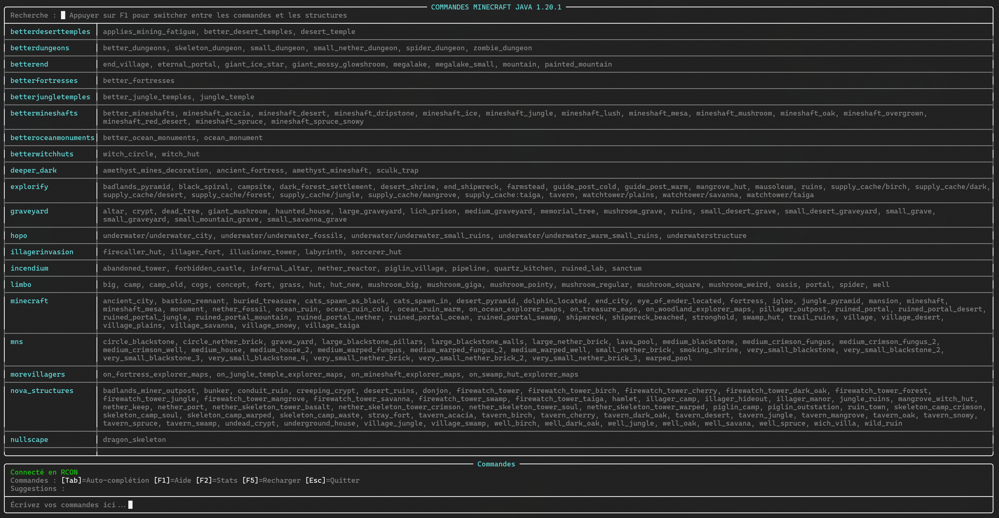
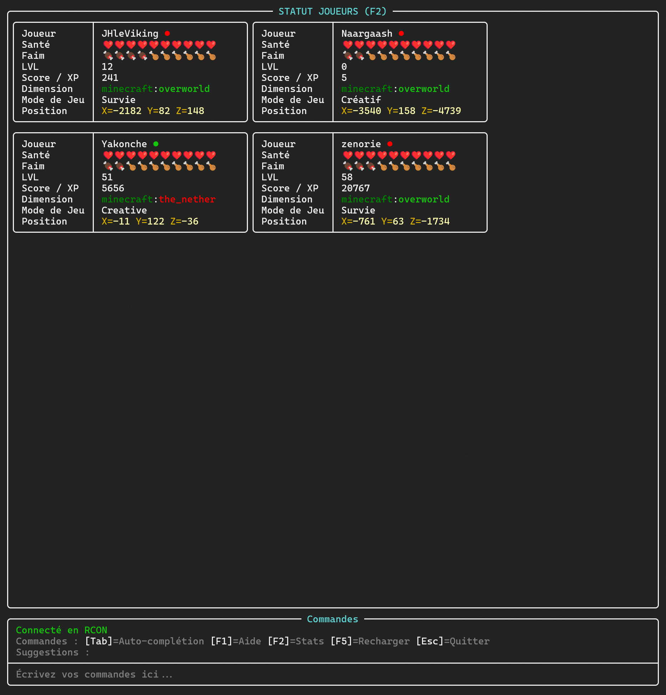
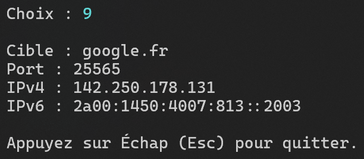

# Explorateur de Spirale Minecraft

[🇬🇧 Read in English](README.md)

> Outil Python qui explore un monde Minecraft en spirale carrée via RCON. Reprise via sauvegardes. Interface TUI.

## Captures d’écran

- 
- 
- 
- 
- 
- 
- 
- 
- 

## Fonctionnalités

### Exploration automatique
- Spirale carrée avec pas de chunks configurable.
- Téléportation dans la dimension cible via `execute in <dimension> run tp <player> X Y Z`.
- Intervalle fixe, ETA global, pause automatique si erreur RCON ou joueur hors ligne.
- Reprise automatique depuis la dernière sauvegarde.

### TUI
- Panneaux Statut et Prochain TP avec barre de progression et couleurs.
- Journal des TP aligné gauche/droite avec validation des coordonnées renvoyées par le serveur.
- Raccourcis : **N** suivant, **P** pause, **C** contrôle libre, **Esc** quitter.

### Contrôle libre
- Déplacements manuels par pas de chunks, hauteur ±16, pas ×2/÷2, avec affichage des coordonnées attendues vs renvoyées.
- Démarrer depuis le spawn, une sauvegarde, ou la position NBT actuelle du joueur.

### Sauvegardes
- JSON dans `saves/` avec nom de fichier automatique et stable basé sur les paramètres + hash court.
- Reconstruire une sauvegarde « comme si N téléportations avaient déjà eu lieu ».

### Chat + RCON
- Console pour lire le chat et envoyer des messages et des commandes.

#### Éléments identifiés sur les captures
- Aide interactive pour **commandes** et **structures** avec recherche et bascule **F1**.
- Auto‑complétion avec **Tab**, ligne de suggestions en bas, **F5** pour recharger la liste.
- Panneau **Statut joueurs** (**F2**) avec Santé, Faim, Niveau/XP, Dimension, Mode de jeu, Position.
- Vue Chat avec **séparateurs de date** et événements de connexion/déconnexion.

### Outils supplémentaires
- **Résolveur serveur** : découverte SRV `_minecraft._tcp` et collecte IPv4/IPv6.
- **Lecteur NBT joueur** : santé/faim/XP/monde/mode de jeu/position depuis `world/playerdata/*.dat` avec `usernamecache.json` ; carte `--dims-json`.

### Configuration
- `config.json` avec fusion automatique des nouvelles clés. Éditeur TUI interactif.

### Mode simulation
- Exécution à blanc sans envoyer de commandes au serveur.

## Installation
```bash
git clone <repo>
cd <repo>
python3 -m venv .venv
source .venv/bin/activate
pip install -r requirements.txt
```

## Utilisation
Activez l’environnement virtuel puis :
```bash
python main.py
```
Ou :
```bash
.venv/bin/python main.py
```
