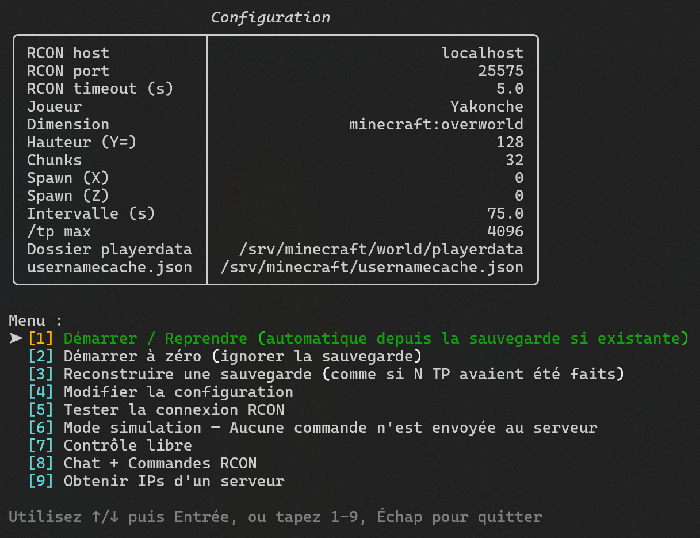
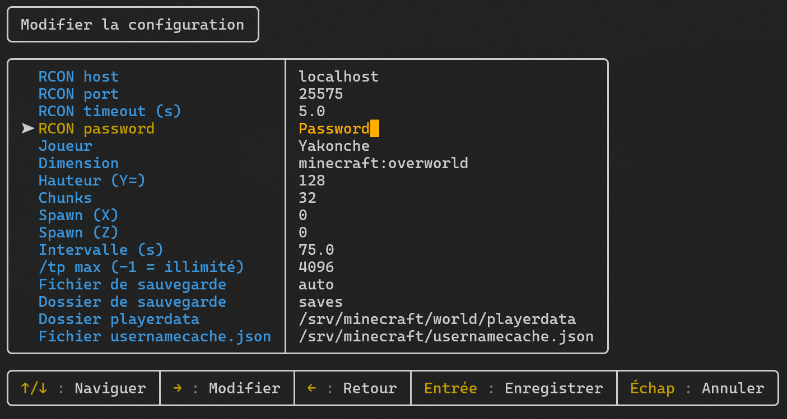

# Minecraft Spiral Explorer

[🇫🇷 Lire en français](README-FR.md)

> Python tool that explores a Minecraft world in a square spiral via RCON. Resumable via saves. Text UI.

## Screenshots

- 
- 
- 
- 
- 
- 
- 
- 
- 

## Features

### Auto exploration
- Square spiral with configurable chunk step. fileciteturn3file16
- Teleport in target dimension using `execute in <dimension> run tp <player> X Y Z`. fileciteturn3file3
- Fixed interval, global ETA, auto‑pause on RCON error or offline player. fileciteturn3file16
- Auto resume from the latest save. fileciteturn3file6

### TUI
- Status and Next‑TP panels with a progress bar and colors. fileciteturn3file16
- Left/right aligned TP log with server‑returned coordinates validation. fileciteturn3file10
- Hotkeys: **N** next, **P** pause, **C** free control, **Esc** quit. fileciteturn3file10

### Free control
- Manual moves in chunk steps, height ±16, step ×2/÷2, with expected vs returned coords display. fileciteturn3file13
- Start from spawn, from save, or from the player’s current NBT position. fileciteturn3file19

### Saves
- JSON under `saves/` with stable auto filename from params + short hash. fileciteturn3file5
- Rebuild a save “as if N teleports already happened”. fileciteturn3file4

### Chat + RCON
- Console to read chat and send messages and commands. fileciteturn3file7

#### New items identified from screenshots
- Interactive **help** for **commands** and **structures** with search and **F1** toggle. *(see screenshots)*
- **Tab** auto‑completion, bottom suggestions line, **F5** to reload the list. *(see screenshots)*
- **Players status** panel (**F2**) with Health, Hunger, Level/XP, Dimension, Gamemode, Position. *(see screenshots)*
- Chat view with **date separators** and join/leave events. *(see screenshots)*

### Extra tools
- **Server resolver**: `_minecraft._tcp` SRV discovery and IPv4/IPv6 collection. fileciteturn3file0turn3file2
- **Player NBT reader**: health/hunger/XP/world/gamemode/position from `world/playerdata/*.dat` with `usernamecache.json`; `--dims-json` map. fileciteturn3file9

### Configuration
- `config.json` with auto‑merge of new keys. Interactive TUI editor. fileciteturn3file1turn3file14

### Simulation mode
- Dry‑run with no commands sent. fileciteturn3file6

## Installation
```bash
git clone <repo>
cd <repo>
python3 -m venv .venv
source .venv/bin/activate
pip install -r requirements.txt
```

## Usage
Activate venv aand :
```bash
python main.py
```
Or :
```
.venv/bin/python main.py
```
